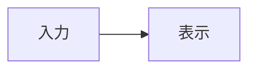

# Markdown 記法テストドキュメント

この文書は、Toybox の作品説明で使える Markdown のチートシート兼表示テストです。作品詳細、編集画面のプレビュー、分割・ライブモードは同じプレビューを使います。コメント欄は対象外です。

見出しから特殊文字までは実際に使える例、後半は対応と未対応の境界、最後は安全性を確認する入力です。未対応例もコードとして隠さず、プレビューでどう見えるかを確認できるようにしています。記法の説明と実際の表示が違う場合は、実装と Storybook の検証を優先してください。

| 分野 | 主な記法 | Toybox での扱い |
| --- | --- | --- |
| 基本 | 見出し、段落、強調、リスト、引用、区切り線 | 対応 |
| GFM | 表、タスク、取り消し線、脚注 | 対応 |
| Toybox の表示 | 見出しリンク、アラート、コードのコピー、ファイル名 | 対応 |
| 数式 | ドル記号で囲むインライン式とブロック式 | KaTeX で表示 |
| 限定的な HTML | 折りたたみ、下線、ハイライト、上下付き、画像幅 | 許可したタグ・属性のみ対応 |
| 他サイトの拡張 | Mermaid、定義リスト、カード埋め込み、独自コンテナ | 専用表示は未対応 |
| 安全性 | スクリプト、埋め込み、イベント属性、任意の CSS | 除去・無効化 |

よく使う記法の早見表です。下の各節には、実際に描画する例と境界例があります。

| 用途 | 入力する記法 |
| --- | --- |
| 見出し | `# 見出し`、`## 小見出し` |
| 太字・斜体 | `**太字**`、`*斜体*`、`***両方***` |
| 取り消し線 | `~~削除~~` |
| 箇条書き・番号 | `- 項目`、`1. 項目` |
| タスク | `- [x] 完了`、`- [ ] 未完了` |
| 引用・アラート | `> 引用`、`> [!NOTE]` |
| リンク・画像 | `[表示名](URL)`、`` |
| 参照形式 | `[表示名][id]` と `[id]: URL` |
| 脚注 | `文[^id]` と `[^id]: 内容` |
| 表 | 見出し行と `---` の区切り行をパイプで囲む |
| コード | ``inline``、`~~~ts` から `~~~` まで |
| 数式 | `$x^2$`、独立した行の `$$` で囲む |
| 折りたたみ | `<details><summary>見出し</summary>本文</details>` |
| 下線・ハイライト | `<u>下線</u>`、`<mark>強調</mark>` |
| 画像の幅 | `` |
| 文字としての記号 | `\*`、`\$` のようにバックスラッシュを付ける |

---

# 見出しレベル1

## 見出しレベル2

### 見出しレベル3

#### 見出しレベル4

##### 見出しレベル5

###### 見出しレベル6

別形式の見出しレベル1
======================

別形式の見出しレベル2
----------------------

## 文章と改行

これは通常の段落です。
ソースコード上の通常の改行は、GFM と同様に表示上はつながります。

段落を分けるには、間に空行を入れます。

行末に半角スペースを2つ入れると、  
段落を変えずに改行できます。

## 文字の装飾

通常の文字です。

*アスタリスク1個による斜体*  
_アンダースコア1個による斜体_

**アスタリスク2個による太字**  
__アンダースコア2個による太字__

***太字かつ斜体***  
___こちらも太字かつ斜体___

~~取り消し線で表示される文章です。~~ GFM では ~波線 1 個でも取り消し線~ になります。

キーボード操作は `Ctrl` + `C` のようにインラインコードで表せます。

変数は `userName`、コマンドは `npm run build` のようにインラインコードで表します。

太字の中に **`インラインコード` を入れる** こともできます。

## エスケープ

Markdown の特殊文字をそのまま表示するには、バックスラッシュを使います。

\*これは斜体になりません\*  
\# これは見出しになりません  
\- これはリストになりません  
\> これは引用になりません  
\[これはリンクになりません\](https://example.com)

使用できる代表的な特殊文字：

\` \* \_ \{ \} \[ \] \( \) \# \+ \- \. \! \> \|

## 引用

> これは引用文です。
>
> 引用文の中に複数の段落を含められます。
>
> — Markdown テスト担当者

### ネストした引用

> 第1階層の引用です。
>
> > 第2階層の引用です。
> >
> > > 第3階層の引用です。
>
> 第1階層へ戻りました。

### 引用内の装飾

> **重要:** 引用内でも *斜体*、`コード`、[リンク](https://example.com)を利用できます。
>
> - 引用内のリスト項目1
> - 引用内のリスト項目2

## 箇条書きリスト

### ハイフンによるリスト

- りんご
- みかん
- ぶどう

### アスタリスクによるリスト

* 赤
* 青
* 緑

### プラス記号によるリスト

+ 春
+ 夏
+ 秋
+ 冬

### ネストしたリスト

- フロントエンド
  - React
    - コンポーネント
    - Hooks
  - TypeScript
    - 型エイリアス
    - インターフェース
  - CSS
    - CSS Modules
    - カスタムプロパティ
- バックエンド
  - Go
  - PostgreSQL
  - REST API

## 番号付きリスト

1. 要件を確認する
2. 実装する
3. テストする
4. レビューする
5. リリースする

すべて `1.` と書いても、自動的に連番になります。

1. 最初の項目
1. 次の項目
1. さらに次の項目

番号を途中から始める例です。

5. 5番目の項目
6. 6番目の項目
7. 7番目の項目

### 番号付きリストのネスト

1. プロジェクトを準備する
   1. リポジトリをクローンする
   2. 依存関係をインストールする
      1. Node.js のバージョンを確認する
      2. `npm ci` を実行する
2. 開発サーバーを起動する
3. ブラウザで確認する

### 複合リスト

1. 最初の作業

   この段落は最初のリスト項目に属します。

   ```bash
   npm ci
   npm run dev
   ```

2. 次の作業

   - 命名規則を確認する
   - Lint を実行する
   - ビルドを実行する

## タスクリスト

- [x] Markdown ファイルを作成する
- [x] 見出しを追加する
- [ ] 内容をレビューする
- [ ] 誤字を修正する
- [ ] 公開する
  - [x] ローカルで確認する
  - [ ] 本番環境で確認する

## リンク

### インラインリンク

[Example Domain](https://example.com)

[タイトル属性付きリンク](https://example.com "Example Domain を開く")

### 相対リンク

[README を開く](./README.md)

[ひとつ上のディレクトリ](../)

### 参照形式のリンク

[検索エンジン][search]を利用して、[Markdown][markdown]について調べます。

[search]: https://www.google.com "Google"
[markdown]: https://daringfireball.net/projects/markdown/ "Markdown"

### 短縮参照リンク

[Example]へ移動します。

[Example]: https://example.com

### 自動リンク

<https://example.com>

<sample@example.com>

URL をそのまま書いてもリンクにはなりません。

https://example.com/docs/getting-started

### ページ内リンク

[表のセクションへ移動](#表)

## 画像

### 通常の画像


### リンク付き画像

[](https://example.com)

### 参照形式の画像

![参照形式のサンプル画像][sample-image]

[sample-image]: https://placehold.co/400x150/png "参照形式の画像"

## インラインコード

JavaScript では `console.log("Hello, Markdown!");` のように記述します。

バッククォート自体を含む場合は、`` `code` `` のように外側を2個のバッククォートで囲みます。

ファイルパスの例：`src/features/user/UserProfile.tsx`

## コードブロック

インデントによるコードブロックです。

    const message = "Hello";
    console.log(message);

バッククォートによるコードブロックです。

```
言語を指定しないコードブロック
複数行のテキストをそのまま表示できます。
```

### JavaScript

```javascript
const users = [
  { id: 1, name: "Alice" },
  { id: 2, name: "Bob" },
];

for (const user of users) {
  console.log(`${user.id}: ${user.name}`);
}
```

### TypeScript

```typescript
type User = {
  id: string;
  name: string;
  email?: string;
};

function formatUser(user: User): string {
  return `${user.name} (${user.id})`;
}

const user: User = {
  id: "user-001",
  name: "Keitan",
};

console.log(formatUser(user));
```

### React / TSX

```tsx
type ButtonProps = {
  label: string;
  disabled?: boolean;
  onClick: () => void;
};

export function Button({
  label,
  disabled = false,
  onClick,
}: ButtonProps) {
  return (
    <button type="button" disabled={disabled} onClick={onClick}>
      {label}
    </button>
  );
}
```

### CSS

```css
.card {
  display: grid;
  gap: 1rem;
  padding: 1.5rem;
  color: var(--text-color);
  background-color: #ffffff;
  border: 1px solid #dddddd;
  border-radius: 0.5rem;
}

.card:hover {
  box-shadow: 0 4px 12px rgb(0 0 0 / 15%);
}
```

### HTML

```html
<article class="card">
  <h2>記事のタイトル</h2>
  <p>記事の本文です。</p>
  <a href="/articles/1">続きを読む</a>
</article>
```

### JSON

```json
{
  "id": "work-001",
  "title": "Markdown Test",
  "published": true,
  "tags": ["Markdown", "Documentation"]
}
```

### Bash

```bash
npm ci
npm run check:naming
npm run lint
npm run build
```

### Go

```go
package main

import "fmt"

func main() {
	fmt.Println("Hello, Markdown!")
}
```

### diff

```diff
- const message = "古い文章";
+ const message = "新しい文章";
```

### ファイル名付きコード

```ts:src/main.ts
const message = "Toybox";
```

ファイル名は言語名の後に `:` で指定します。言語を指定しないブロックや、インデント形式のコードもコピーできます。

## 表

| 名前 | 種類 | 状態 |
| --- | --- | --- |
| React | UI ライブラリ | 使用中 |
| TypeScript | プログラミング言語 | 使用中 |
| Vite | ビルドツール | 使用中 |
| Biome | Formatter / Linter | 使用中 |

### 文字揃えを指定した表

| 左揃え | 中央揃え | 右揃え |
| :--- | :---: | ---: |
| Apple | Red | 120 |
| Orange | Orange | 80 |
| Grape | Purple | 1,500 |
| **合計** | - | **1,700** |

### 表内の装飾

| 記法 | サンプル | 説明 |
| --- | --- | --- |
| 太字 | **重要** | 強い強調 |
| 斜体 | *補足* | 弱い強調 |
| コード | `npm ci` | コマンド |
| 取り消し線 | ~~廃止~~ | 無効になった情報 |
| リンク | [詳細](https://example.com) | 外部ページ |

表のセル内でパイプを表示する場合は `\|` のようにエスケープします。

| 入力 | 意味 |
| --- | --- |
| `A \| B` | A または B |
| `true && false` | 論理積 |

## 水平線

ハイフンによる水平線：

---

アスタリスクによる水平線：

***

アンダースコアによる水平線：

___

## 脚注

本文の番号から脚注へ移動できます。[^1]

同じ脚注を再度参照できます。[^1]

長い説明を含む脚注も作成できます。[^long-note]

[^1]: これは脚注の内容です。
[^long-note]:
    これは複数行で記述された脚注です。

    脚注内に別の段落や `インラインコード` を含められます。

## 折りたたみ

`details` と `summary` で長い補足情報を折りたためます。本文の前後には空行を入れます。

<details>
<summary>クリックして詳細を表示</summary>

ここは折りたたまれた領域です。

- 折りたたみの中にも **Markdown** を書けます
- キーボードの Enter / Space でも開閉できます
- `details open` で最初から開いた状態にできます

</details>

<details open><summary>最初から開いている補足</summary>

この領域は最初から表示されます。

</details>

## GitHub のアラート記法

> [!NOTE]
> 補足として知っておくと便利な情報です。

> [!TIP]
> 作業を効率よく進めるためのヒントです。

> [!IMPORTANT]
> 作業を完了するために必要な重要情報です。

> [!WARNING]
> 問題を避けるために注意すべき内容です。

> [!CAUTION]
> 操作によって望ましくない結果が起こる可能性があります。

## 絵文字

Unicode 絵文字はそのまま利用できます。

😀 🎉 🚀 ✅ ❌ ⚠️ 💡 📦 🛠️

絵文字ショートコードの変換は未対応です。次の文字列はそのまま表示されます。

`:smile:` `:tada:` `:rocket:` `:white_check_mark:`

## コメント

次の HTML コメントは表示されません。ソースには残るため、秘密情報は書かないでください。

<!-- この文章は HTML コメントなのでレンダリング結果には表示されません。 -->

<!--
複数行のコメントも記述できます。
TODO や編集者向けメモに利用できます。
-->

## 長い実践サンプル

### Toybox の開発日記

今日は、**React** と **TypeScript** を使った小さな機能を実装しました。目的は、ユーザーが登録した作品をカード形式で一覧表示することです。各カードには、作品名、公開状態、作成日時、サムネイル画像を表示します。

公開状態には次の3種類があります。

1. `public`
   - すべてのユーザーが閲覧できます。
2. `private`
   - ログイン済みユーザーが閲覧できます。
3. `draft`
   - 所有者だけが閲覧できます。

実装前に、次の確認項目を整理しました。

- [x] API のレスポンス型を確認する
- [x] 既存のカードコンポーネントを調べる
- [x] ローディング状態を追加する
- [x] 空データの表示を追加する
- [ ] ブラウザでキーボード操作を確認する
- [ ] モバイル幅でレイアウトを確認する

コンポーネントの基本形は次のとおりです。

```tsx
type WorkCardProps = {
  id: string;
  title: string;
  visibility: "public" | "private" | "draft";
};

export function WorkCard({
  id,
  title,
  visibility,
}: WorkCardProps) {
  return (
    <article aria-labelledby={`work-${id}-title`}>
      <h3 id={`work-${id}-title`}>{title}</h3>
      <p>公開状態: {visibility}</p>
    </article>
  );
}
```

レビューでは、次の指摘がありました。

> カード一覧の `key` に配列のインデックスを使うと、並べ替えや削除によって意図しない再利用が起こる可能性があります。作品の安定した ID を使ってください。

修正前と修正後の差分は次のようになりました。

```diff
- {works.map((work, index) => (
-   <WorkCard key={index} {...work} />
+ {works.map((work) => (
+   <WorkCard key={work.id} {...work} />
  ))}
```

検証結果を表にまとめます。

| 検証項目 | コマンド | 結果 |
| :--- | :--- | :---: |
| 命名規則 | `npm run check:naming` | ✅ 成功 |
| Lint | `npm run lint` | ✅ 成功 |
| ビルド | `npm run build` | ✅ 成功 |
| ブラウザ確認 | 手動操作 | ⚠️ 未実施 |

> [!IMPORTANT]
> コマンドが成功しても、ローディング、空データ、通信エラー、直接 URL を開いた場合の挙動はブラウザで別途確認する必要があります。

詳しい情報は[プロジェクトのドキュメント](./README.md)を参照してください。

---

## 入れ子を組み合わせた複雑な例

1. **調査**
   - ドキュメントを読む
     - `README.md`
     - `DesignDoc.md`
   - 現行コードを読む
     - ページ
     - Feature
     - API クライアント

2. **実装**
   > 実装では既存の公開 API を理由なく変更しないようにします。

   ```typescript
   const result = await fetch("/api/works");
   ```

3. **検証**

   | 項目 | 状態 |
   | --- | --- |
   | TypeScript | 完了 |
   | Lint | 完了 |
   | Build | 完了 |

4. **残作業**
   - [ ] レビュー
   - [ ] リリース

## 特殊文字テスト

日本語：こんにちは、Markdown。  
英語：Hello, Markdown!  
数字：0123456789  
記号：! " # \$ % & ' ( ) * + , - . /\
記号：: ; < = > ? @ [ \ ] ^ _ `  
記号：{ | } ~  
全角記号：、。・「」『』【】（）！？  
通貨：¥ \$ € £\
数学記号：± × ÷ ≠ ≦ ≧ ∞ ∑ √  
矢印：← → ↑ ↓ ↔ ⇒  
著作権：© ® ™  
アクセント：à é î ö ü ñ ç  
ギリシャ文字：α β γ δ ε Ω  
キリル文字：Привет  
中国語：你好  
韓国語：안녕하세요  
絵文字：🧸 📚 ✨

## 境界例：見出しと改行

`#` の後に空白がない次の行は、見出しにはなりません。

#空白がない見出し風の行

同じ名前の見出しは URL の末尾に番号が付きます。[最初へ](#重複見出しの例) / [2 個目へ](#重複見出しの例-1)。

### 重複見出しの例

最初の見出しの本文です。

### 重複見出しの例

同名の 2 個目の本文です。

普通の改行は同じ段落にまとまります。
この行は直前の文章につながります。

行末にバックスラッシュを書くと\
強制的に改行します。

空行を挟むと別の段落です。

横線は前後を空けて書きます。次は水平線です。

---

`***` を文章中に書く場合は、エスケープするかインラインコードで囲みます。

## 境界例：強調・コード・エスケープ

**太字の中の *斜体***、*斜体の中の **太字***、~~取り消し線の中の **太字**~~。

日本語の前後でも **強調** と `inline code` を使えます。強調の外側の空白、句読点、括弧も確認できます。

エスケープした \*星印\*、\_下線\_、\[角括弧\]、\~波線\~、\$ドル記号は装飾になりません。

HTML の特殊文字は &amp;、&lt;、&gt;、&quot; と書けます。`&amp;` のようにコード内ではそのまま見えます。

`` `空白を含むコード` `` のように外側のバッククォートを増やすと、コード中のバッククォートも表示できます。

チルダのコードフェンスも使えます。ここにある Markdown 記法はコードのままです。

~~~text
# 見出しにはならない
**太字にはならない**
<script>実行されない</script>
~~~

未知の言語名を指定しても、コード内容は表示されます。専用の色付けがない場合があります。

~~~unknown-language
unknown language still shows this line
~~~

## 境界例：リンク・画像・参照先

明示的に書いた [外部リンク](https://example.com/path?q=1 "説明") はリンクです。山括弧の <https://example.com/path> もリンクです。

裸の https://example.com/path、www.example.com、sample@example.com は Toybox では自動リンクになりません。

文中の @toybox や #123 も、ユーザー・Issue への専用リンクにはなりません。

同じ画像を [画像だけのリンク](https://example.com) にしたい場合は、代替テキストを指定して次のように書きます。

[](https://example.com)

`` の説明は画像の代替テキストです。装飾目的で説明を空にする場合は `` と書きます。ただし、画像だけのリンクには行き先が分かる説明を付けてください。

参照形式と通常のリンクの混在も確認できます。[参照先の再利用][shared-target] / [同じ参照先][shared-target] / [通常のリンク](https://example.com)。

[shared-target]: https://example.com/docs "共通の参照先"

### 画像幅の境界

`width` は 1～2000 の整数、`style` は `width:40px` のような指定だけ使えます。どちらも指定した場合は `style` 側の幅を優先します。枠より広い指定は表示時に縮みます。


上の 2 枚はどちらもサイズ指定が無効です。`height`、`max-width`、`object-fit`、`position` などは HTML 属性・任意の CSS としては受け付けません。

## 境界例：リスト・タスク・表

チェックボックスは表示専用です。プレビュー上でチェックを押しても原文は変更されません。

- [X] 大文字の X を使った完了
- [x] 小文字の x を使った完了
- [ ] 未完了
  - [ ] 入れ子の未完了

番号付きリストは `5.` のように開始番号を指定できます。項目の中に段落とコードを入れる場合はインデントを揃えます。

5. 五番目として始める
6. 次の番号

   続きの段落です。

   ~~~text
   項目内のコード
   ~~~

表では列数が少ない行の空欄、エスケープしたパイプ、長い内容を確認します。狭い画面では表の領域だけ横にスクロールできます。

| 種類 | 値 | 補足 |
| :--- | ---: | :---: |
| パイプ | A \| B | 中央 |
| 空欄 | | 中央 |
| 長いセル | 1234567890123456789012345678901234567890 | **強調** |

表のセル内で通常の改行を使っても、別の段落や複雑なブロックにはなりません。必要なら表の外でリストや折りたたみを使います。

## 境界例：脚注・引用・折りたたみ

同じ脚注を複数回使うと、同じ定義へ移動します。最初の参照[^reused-note]と再参照[^reused-note]です。

[^reused-note]: 同じ脚注を繰り返し参照した例です。

> 引用の中にリストや **装飾** を入れられます。
>
> - 引用内の項目
> - [引用内のリンク](https://example.com)

`<details>` は入れ子にもできます。クリックや Enter / Space で開閉します。

<details>
<summary>境界例の折りたたみ</summary>

外側の本文です。

<details>
<summary>入れ子の折りたたみ</summary>

**内側でも Markdown** が使えます。

</details>

</details>

## 収録項目

この文書には、主に次の記法が含まれています。

- 見出し
- 段落と改行
- 太字、斜体、取り消し線
- インラインコード
- 引用とネストした引用
- 箇条書き、番号付きリスト、タスクリスト
- リンク、参照リンク、自動リンク
- 画像
- コードブロックとシンタックスハイライト
- 表と文字揃え
- 水平線
- 脚注
- 折りたたみ
- GitHub アラート
- コメント
- エスケープ
- 絵文字
- 特殊文字
- 数式と限定的な HTML 装飾
- 幅指定がある画像と無効な指定
- 記法の境界例

## 対応と未対応の境界

ここからは**記法を囲って隠さずに入力**しています。Toybox のプレビューと、[GitHub の数式](https://docs.github.com/en/get-started/writing-on-github/working-with-advanced-formatting/writing-mathematical-expressions)・[図表](https://docs.github.com/en/get-started/writing-on-github/working-with-advanced-formatting/creating-diagrams)、[Zenn の記法](https://zenn.dev/zenn/articles/markdown-guide)、[Qiita の記法](https://qiita.com/Qiita/items/c686397e4a0f4f11683d)を比較できます。他のサイトが対応していても、Toybox で同じ表示になるとは限りません。

### 対応：数式

ドル記号で囲んだ式は数式として表示されます。インライン式：$E = mc^2$。二重ドルを同じ行に書いた式：$$ E = mc^2 $$。

文字としてドル記号を表示する場合は `\$` と書きます。

分数と添字：$\frac{a_1+b_2}{2}$。

$$
E = mc^2
$$

$$
\sum_{i=1}^{n} i = \frac{n(n+1)}{2}
$$

数式として解釈できない式は KaTeX のエラー表示になります。原文を保ちたい場合はコードで囲んでください。

### 未対応：Mermaid の図

GitHub と Qiita では `mermaid` を指定したコードブロックを図にできます。Toybox ではコードとして表示され、図には変換されません。フェンス自体が Mermaid 記法の一部です。



### 未対応：定義リスト

次の `用語` と `: 定義` は定義リストには変換されません。

用語
: 定義

### 未対応：Zenn と Qiita のコンテナ

Zenn のメッセージと折りたたみ、Qiita の補足は Toybox では専用の枠になりません。Toybox のアラートは上記の `> [!NOTE]` 形式、折りたたみは `<details>` 形式です。

:::message
Zenn のメッセージ
:::

:::details Zenn の折りたたみ
中身は Toybox では折りたたまれません。
:::

:::note info
Qiita の補足
:::

### 未対応：外部サービスの埋め込み

Zenn や Qiita では URL 単独行をカードや投稿の埋め込みとして扱う場合があります。Toybox では通常の文字列です。

https://qiita.com/Qiita/items/c686397e4a0f4f11683d

Zenn のカード指定も埋め込みにはなりません：@[card](https://example.com)。通常のリンクを作る場合は [Example Domain](https://example.com) と書きます。

### 対応：限定的な HTML 装飾と画像幅

下線：<u>下線を付けたい文字</u>。ハイライト：<mark>注目してほしい文字</mark>。下付き文字：H<sub>2</sub>O。上付き文字：2<sup>10</sup>。HTML の改行：一行目<br>二行目。

画像の `width` と `style="width:40px"` は、1～2000px の幅だけ反映されます。画像は表示枠より大きくなりません。その他の `style` は反映されません。


### 未対応：文字色と旧式の HTML

`<font>` は旧式の HTML です。色の指定は反映されず、文字だけが残ります：**<font color="#B2C42D">抹茶</font>**。

`<span style="color:...">` などの任意の CSS も使えません：<span style="color:#B2C42D">色を指定した文字</span>。

キーボード風の `<kbd>`、ルビの `<ruby>` も専用の見た目にはなりません：<kbd>Ctrl</kbd>、<ruby>抹茶<rt>まっちゃ</rt></ruby>。

ハイライトを付ける場合は `<mark>` を使います。`==この記法==` は変換されません：==この記法はそのまま==。

### 未対応：HTML のメディアと埋め込み

`<video>`、`<audio>`、`<iframe>`、フォームは作品説明のプレーヤーや入力欄として使えません。動画・音声ファイルは作品のアセットとして登録してください。

<video controls src="https://example.com/movie.mp4">動画の代替文字</video>
<audio controls src="https://example.com/sound.mp3">音声の代替文字</audio>

### 未対応：他の Markdown 方言

YAML front matter はメタデータとして解釈されません。文書先頭の `---` は水平線にもなり得るため、例はコードとして載せています。

~~~yaml
---
title: Toybox の作品
tags:
  - markdown
---
~~~

MDX のコンポーネント、画像サイズを URL の末尾に書く方言、波括弧による属性指定も専用には解釈されません。

~~~mdx
<MyComponent title="見出し" />

## 見出し {#custom-id}
~~~

### 安全性：危険な入力の確認

以下は安全性を確認するための入力です。スクリプト、埋め込み、SVG は表示されず、イベント属性、CSS、危険な URL は使えない状態になる想定です。この段落の文字は残ります。

<script>window.__toyboxMarkdownSampleExecuted = true</script>
<iframe src="https://example.com" onload="window.__toyboxMarkdownSampleExecuted = true"></iframe>
<svg onload="window.__toyboxMarkdownSampleExecuted = true"><circle r="5" /></svg>

<details open ontoggle="window.__toyboxMarkdownSampleExecuted = true" style="display:none"><summary onclick="window.__toyboxMarkdownSampleExecuted = true">属性を除去する折りたたみ</summary>

安全性を確認する本文です。

</details>

[危険なスキームのリンク](javascript:window.__toyboxMarkdownSampleExecuted=true)

<a href="javascript:window.__toyboxMarkdownSampleExecuted=true" onmouseover="window.__toyboxMarkdownSampleExecuted = true">HTML の危険なリンク</a>
