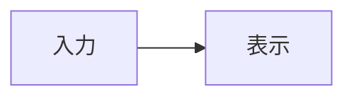

# Markdown チートシート

Toybox の作品説明で使える記法を、**表示例 → 入力する記法**の順にまとめています。作品詳細と編集画面のプレビューが対象です。

## 見出し

# h1

```
# h1
```

## h2

```
## h2
```

### h3

```
### h3
```

#### h4

```
#### h4
```

##### h5

```
##### h5
```

###### h6

```
###### h6
```

`#` の後には半角スペースを入れます。

**下線形式の h1**

別形式の見出しレベル1
======================

```
別形式の見出しレベル1
======================
```

**下線形式の h2**

別形式の見出しレベル2
----------------------

```
別形式の見出しレベル2
----------------------
```

## 文章と改行

### 段落

最初の段落です。

次の段落です。

```
最初の段落です。

次の段落です。
```

### 通常の改行

一行目です。
二行目です。

```
一行目です。
二行目です。
```

Enter で改行すると、プレビューでも改行されます。

### 行末の半角スペース2つによる改行

一行目です。  
二行目です。

```
一行目です。  
二行目です。
```

コードブロックの一行目の末尾には、半角スペースが2つあります。

### バックスラッシュによる改行

一行目です。\
二行目です。

```
一行目です。\
二行目です。
```

### HTML による改行

一行目です。<br>二行目です。

```
一行目です。<br>二行目です。
```

## 文字の装飾

### 斜体

*アスタリスク1個による斜体*

_アンダースコア1個による斜体_

```
*アスタリスク1個による斜体*

_アンダースコア1個による斜体_
```

### 太字

**アスタリスク2個による太字**

__アンダースコア2個による太字__

```
**アスタリスク2個による太字**

__アンダースコア2個による太字__
```

### 太字と斜体

***太字かつ斜体***

___こちらも太字かつ斜体___

```
***太字かつ斜体***

___こちらも太字かつ斜体___
```

### 取り消し線

~~取り消し線~~

~波線 1 個でも取り消し線~

```
~~取り消し線~~

~波線 1 個でも取り消し線~
```

### 装飾の組み合わせ

**太字の中の *斜体***、*斜体の中の **太字***、~~取り消し線の中の **太字**~~。

```
**太字の中の *斜体***、*斜体の中の **太字***、~~取り消し線の中の **太字**~~。
```

### 下線

<u>下線を付けたい文字</u>

```
<u>下線を付けたい文字</u>
```

### ハイライト

<mark>注目してほしい文字</mark>

```
<mark>注目してほしい文字</mark>
```

### 下付き文字

H<sub>2</sub>O

```
H<sub>2</sub>O
```

### 上付き文字

2<sup>10</sup>

```
2<sup>10</sup>
```

## インラインコード

コマンドは `npm run build` です。

```
コマンドは `npm run build` です。
```

### バッククォートを含むコード

バッククォートも含める：`` `code` ``。

```
バッククォートも含める：`` `code` ``。
```

### 太字との組み合わせ

**`インラインコード` を太字にする**

```
**`インラインコード` を太字にする**
```

## 引用

> これは引用文です。
>
> 引用内の別の段落です。

```
> これは引用文です。
>
> 引用内の別の段落です。
```

### ネストした引用

> 第1階層の引用です。
>
> > 第2階層の引用です。
> >
> > > 第3階層の引用です。

```
> 第1階層の引用です。
>
> > 第2階層の引用です。
> >
> > > 第3階層の引用です。
```

### 引用内の装飾とリスト

> **重要:** *斜体*、`コード`、[リンク](https://example.com)を使えます。
>
> - 引用内のリスト項目1
> - 引用内のリスト項目2

```
> **重要:** *斜体*、`コード`、[リンク](https://example.com)を使えます。
>
> - 引用内のリスト項目1
> - 引用内のリスト項目2
```

## 箇条書きリスト

### ハイフン

- 項目1
- 項目2

```
- 項目1
- 項目2
```

### アスタリスク

* 項目1
* 項目2

```
* 項目1
* 項目2
```

### プラス記号

+ 項目1
+ 項目2

```
+ 項目1
+ 項目2
```

### ネストしたリスト

- フロントエンド
  - React
    - コンポーネント
  - TypeScript
- バックエンド
  - Go

```
- フロントエンド
  - React
    - コンポーネント
  - TypeScript
- バックエンド
  - Go
```

## 番号付きリスト

1. 要件を確認する
2. 実装する
3. テストする

```
1. 要件を確認する
2. 実装する
3. テストする
```

### 括弧による番号

1) 要件を確認する
2) 実装する
3) テストする

```
1) 要件を確認する
2) 実装する
3) テストする
```

### 自動で連番にする

1. 最初の項目
1. 次の項目
1. さらに次の項目

```
1. 最初の項目
1. 次の項目
1. さらに次の項目
```

### 開始番号の指定

5. 5番目の項目
6. 6番目の項目

```
5. 5番目の項目
6. 6番目の項目
```

### 番号付きリストのネスト

1. 準備する
   1. 依存関係を確認する
   2. インストールする
2. 起動する

```
1. 準備する
   1. 依存関係を確認する
   2. インストールする
2. 起動する
```

## タスクリスト

- [x] 小文字の x を使った完了
- [X] 大文字の X を使った完了
- [ ] 未完了
  - [ ] 入れ子の未完了

```
- [x] 小文字の x を使った完了
- [X] 大文字の X を使った完了
- [ ] 未完了
  - [ ] 入れ子の未完了
```

チェックボックスは表示専用です。プレビュー上では変更できません。

## リンク

### 通常のリンク

[Example Domain](https://example.com)

```
[Example Domain](https://example.com)
```

### タイトル付きリンク

[タイトル属性付きリンク](https://example.com "Example Domain を開く")

```
[タイトル属性付きリンク](https://example.com "Example Domain を開く")
```

### サイト内のリンク

[作品一覧](/works)

```
[作品一覧](/works)
```

### 相対リンク

[相対パス](./example)

[ひとつ上の階層](../)

```
[相対パス](./example)

[ひとつ上の階層](../)
```

相対パスは現在表示しているページの URL を基準に解決されます。

### 参照形式のリンク

[参照先の再利用][shared-target] / [同じ参照先][shared-target]

[shared-target]: https://example.com/docs "共通の参照先"

```
[参照先の再利用][shared-target] / [同じ参照先][shared-target]

[shared-target]: https://example.com/docs "共通の参照先"
```

### 省略参照リンク

[省略した参照][]

[省略した参照]: https://example.com

```
[省略した参照][]

[省略した参照]: https://example.com
```

### 短縮参照リンク

[短縮参照]

[短縮参照]: https://example.com

```
[短縮参照]

[短縮参照]: https://example.com
```

### 山括弧による自動リンク

<https://example.com>

<sample@example.com>

```
<https://example.com>

<sample@example.com>
```

### URL・メールアドレスの自動リンク

https://example.com/docs/getting-started

www.example.com

sample@example.com

```
https://example.com/docs/getting-started

www.example.com

sample@example.com
```

### メールリンク

[メールを送る](mailto:sample@example.com)

```
[メールを送る](mailto:sample@example.com)
```

### ページ内リンク

[表のセクションへ移動](#表)

```
[表のセクションへ移動](#表)
```

見出しには自動でリンク先が付きます。見出し横のリンクボタンから、その見出しの URL をコピーできます。外部の HTTP / HTTPS リンクは別タブで開きます。

### HTML によるリンク先の指定

<p id="custom-anchor">独自のリンク先</p>

[独自のリンク先へ](#custom-anchor)

```
<p id="custom-anchor">独自のリンク先</p>

[独自のリンク先へ](#custom-anchor)
```

## 画像

### 通常の画像とタイトル


```

```

リンクのない画像はクリックすると全画面表示できます。

### 参照形式の画像

![参照形式のサンプル画像][sample-image]

[sample-image]: https://placehold.co/400x150/png "参照形式の画像"

```
![参照形式のサンプル画像][sample-image]

[sample-image]: https://placehold.co/400x150/png "参照形式の画像"
```

### 省略参照の画像

![省略参照の画像][]

[省略参照の画像]: https://placehold.co/120x40/png

```
![省略参照の画像][]

[省略参照の画像]: https://placehold.co/120x40/png
```

### 短縮参照の画像

![短縮参照の画像]

[短縮参照の画像]: https://placehold.co/120x40/png

```
![短縮参照の画像]

[短縮参照の画像]: https://placehold.co/120x40/png
```

### リンク付き画像

[](https://example.com)

```
[](https://example.com)
```

リンク付き画像をクリックするとリンク先へ移動します。

### width 属性による幅指定


```

```

### style 属性による幅指定


```

```

### 幅指定を併用した場合


```

```

幅は 1〜2000px の整数を指定できます。併用すると `style` の幅を優先します。表示枠より広い画像は縮みます。`style` は `width:数値px` のみ使えます。

## コードブロック

### バッククォート形式

```
言語を指定しないコードブロック
複数行のテキストをそのまま表示できます。
```

````
```
言語を指定しないコードブロック
複数行のテキストをそのまま表示できます。
```
````

### チルダ形式

~~~text
# 見出しにはならない
**太字にはならない**
~~~

```
~~~text
# 見出しにはならない
**太字にはならない**
~~~
```

### インデント形式

    const message = "Hello";
    console.log(message);

```
    const message = "Hello";
    console.log(message);
```

各行の先頭に半角スペースを4つ入れます。

### 言語指定とシンタックスハイライト

```ts
const message: string = "Toybox";
```

````
```ts
const message: string = "Toybox";
```
````

言語名には `javascript`、`typescript`、`tsx`、`css`、`html`、`json`、`bash`、`c`、`go`、`diff` などを指定できます。

```json
{
  "title": "Toybox",
  "tags": ["Markdown", "チートシート"]
}
```

````
```json
{
  "title": "Toybox",
  "tags": ["Markdown", "チートシート"]
}
```
````

```c
#include <stdio.h>

typedef struct {
    const char *name;
    int score;
} Student;

double calculate_average(const Student students[], size_t count) {
    if (count == 0) {
        return 0.0;
    }

    int total = 0;
    for (size_t i = 0; i < count; i++) {
        total += students[i].score;
    }

    return (double)total / count;
}

int main(void) {
    const Student students[] = {
        {"Alice", 85},
        {"Bob", 72},
        {"Charlie", 94},
    };
    const size_t count = sizeof students / sizeof students[0];

    for (size_t i = 0; i < count; i++) {
        const char *result = students[i].score >= 80 ? "PASS" : "RETRY";
        printf("%-8s %3d %s\n",
               students[i].name, students[i].score, result);
    }

    printf("Average: %.1f\n", calculate_average(students, count));
    return 0;
}
```

````
```c
#include <stdio.h>

typedef struct {
    const char *name;
    int score;
} Student;

double calculate_average(const Student students[], size_t count) {
    if (count == 0) {
        return 0.0;
    }

    int total = 0;
    for (size_t i = 0; i < count; i++) {
        total += students[i].score;
    }

    return (double)total / count;
}

int main(void) {
    const Student students[] = {
        {"Alice", 85},
        {"Bob", 72},
        {"Charlie", 94},
    };
    const size_t count = sizeof students / sizeof students[0];

    for (size_t i = 0; i < count; i++) {
        const char *result = students[i].score >= 80 ? "PASS" : "RETRY";
        printf("%-8s %3d %s\n",
               students[i].name, students[i].score, result);
    }

    printf("Average: %.1f\n", calculate_average(students, count));
    return 0;
}
```
````

### ファイル名付きコード

```ts:src/main.ts
const message = "Toybox";
```

````
```ts:src/main.ts
const message = "Toybox";
```
````

言語名の後に `:` とファイル名を書きます。コードブロックはコピーボタンでコピーできます。

### 未知の言語名

```unknown-language:example.txt
unknown language still shows this line
```

````
```unknown-language:example.txt
unknown language still shows this line
```
````

未知の言語名でもコードを表示できます。専用の色付けがない場合があります。

## 表

| 名前 | 種類 |
| --- | --- |
| React | UI ライブラリ |
| TypeScript | プログラミング言語 |

```
| 名前 | 種類 |
| --- | --- |
| React | UI ライブラリ |
| TypeScript | プログラミング言語 |
```

### 文字揃え

| 左揃え | 中央揃え | 右揃え |
| :--- | :---: | ---: |
| Apple | Red | 120 |
| Orange | Orange | 80 |

```
| 左揃え | 中央揃え | 右揃え |
| :--- | :---: | ---: |
| Apple | Red | 120 |
| Orange | Orange | 80 |
```

### セル内の装飾・パイプ・改行

| 種類 | 値 |
| --- | --- |
| 太字 | **重要** |
| 斜体 | *補足* |
| コード | `npm ci` |
| 取り消し線 | ~~廃止~~ |
| リンク | [詳細](https://example.com) |
| パイプ | A \| B |
| 改行 | 一行目<br>二行目 |

```
| 種類 | 値 |
| --- | --- |
| 太字 | **重要** |
| 斜体 | *補足* |
| コード | `npm ci` |
| 取り消し線 | ~~廃止~~ |
| リンク | [詳細](https://example.com) |
| パイプ | A \| B |
| 改行 | 一行目<br>二行目 |
```

狭い画面では表の領域を横にスクロールできます。

## 水平線

### ハイフン

---

```
---
```

### アスタリスク

***

```
***
```

### アンダースコア

___

```
___
```

水平線の前後には空行を入れます。

## 脚注

本文から脚注へ移動できます。[^note]

同じ脚注を再度参照できます。[^note]

[^note]: これは脚注の内容です。

```
本文から脚注へ移動できます。[^note]

同じ脚注を再度参照できます。[^note]

[^note]: これは脚注の内容です。
```

### 複数段落の脚注

長い説明を含む脚注です。[^long-note]

[^long-note]:
    これは複数行の脚注です。

    別の段落や `インラインコード` も含められます。

```
長い説明を含む脚注です。[^long-note]

[^long-note]:
    これは複数行の脚注です。

    別の段落や `インラインコード` も含められます。
```

## 折りたたみ

<details>
<summary>クリックして詳細を表示</summary>

ここは折りたたまれた領域です。

- **Markdown** も書けます
- 本文の前後に空行を入れます

</details>

```
<details>
<summary>クリックして詳細を表示</summary>

ここは折りたたまれた領域です。

- **Markdown** も書けます
- 本文の前後に空行を入れます

</details>
```

### 最初から開く

<details open>
<summary>最初から開いている補足</summary>

この領域は最初から表示されます。

</details>

```
<details open>
<summary>最初から開いている補足</summary>

この領域は最初から表示されます。

</details>
```

### 入れ子の折りたたみ

<details>
<summary>外側の折りたたみ</summary>

<details>
<summary>入れ子の折りたたみ</summary>

**内側でも Markdown** が使えます。

</details>

</details>

```
<details>
<summary>外側の折りたたみ</summary>

<details>
<summary>入れ子の折りたたみ</summary>

**内側でも Markdown** が使えます。

</details>

</details>
```

## GitHub のアラート記法

### NOTE

> [!NOTE]
> 補足として知っておくと便利な情報です。

```
> [!NOTE]
> 補足として知っておくと便利な情報です。
```

### TIP

> [!TIP]
> 作業を効率よく進めるためのヒントです。

```
> [!TIP]
> 作業を効率よく進めるためのヒントです。
```

### IMPORTANT

> [!IMPORTANT]
> 作業を完了するために必要な重要情報です。

```
> [!IMPORTANT]
> 作業を完了するために必要な重要情報です。
```

### WARNING

> [!WARNING]
> 問題を避けるために注意すべき内容です。

```
> [!WARNING]
> 問題を避けるために注意すべき内容です。
```

### CAUTION

> [!CAUTION]
> 操作によって望ましくない結果が起こる可能性があります。

```
> [!CAUTION]
> 操作によって望ましくない結果が起こる可能性があります。
```

## 数式

### インライン数式

インライン式：$E = mc^2$。

```
インライン式：$E = mc^2$。
```

### 同じ行の二重ドル

二重ドルを同じ行に書いた式：$$ E = mc^2 $$。

```
二重ドルを同じ行に書いた式：$$ E = mc^2 $$。
```

この形式もインライン数式として表示されます。

### 分数と添字

分数と添字：$\frac{a_1+b_2}{2}$。

```
分数と添字：$\frac{a_1+b_2}{2}$。
```

### ブロック数式

$$
E = mc^2
$$

```
$$
E = mc^2
$$
```

### 総和と分数

$$
\sum_{i=1}^{n} i = \frac{n(n+1)}{2}
$$

```
$$
\sum_{i=1}^{n} i = \frac{n(n+1)}{2}
$$
```

KaTeX で描画します。数式の書き方によってはエラー表示になるため、原文を表示したい場合はコードで囲みます。

## エスケープと特殊文字

### 記法を文字として表示する

\*これは斜体になりません\*

\# これは見出しになりません

\- これはリストになりません

\> これは引用になりません

\[これはリンクになりません\](https://example.com)

```
\*これは斜体になりません\*

\# これは見出しになりません

\- これはリストになりません

\> これは引用になりません

\[これはリンクになりません\](https://example.com)
```

### バックスラッシュでエスケープできる記号

\` \* \_ \{ \} \[ \] \( \) \# \+ \- \. \! \> \| \~ \$

```
\` \* \_ \{ \} \[ \] \( \) \# \+ \- \. \! \> \| \~ \$
```

### HTML の文字参照

&amp; &lt; &gt; &quot; &#169; &#x1F680;

```
&amp; &lt; &gt; &quot; &#169; &#x1F680;
```

### Unicode 絵文字

😀 🎉 🚀 ✅ ❌ ⚠️ 💡 📦 🛠️

```
😀 🎉 🚀 ✅ ❌ ⚠️ 💡 📦 🛠️
```

絵文字を直接入力できます。`:smile:` のようなショートコードの変換は未対応です。

## コメント

<!-- このコメントは表示されません。 -->

```
<!-- このコメントは表示されません。 -->
```

HTML コメントは表示されません。入力した原文には残ります。

### 複数行のコメント

<!--
複数行のコメントです。
編集者向けのメモを書けます。
-->

```
<!--
複数行のコメントです。
編集者向けのメモを書けます。
-->
```

## 入れ子を組み合わせた複雑な例

1. **調査**
   - `README.md` を読む
   - 現行コードを読む

2. **実装**

   > リストの中に引用も入れられます。

   ```ts
   const message = "Toybox";
   ```

3. **検証**

   | 項目 | 状態 |
   | --- | --- |
   | 表示 | 完了 |

4. **残作業**
   - [ ] レビュー
   - [ ] リリース

````
1. **調査**
   - `README.md` を読む
   - 現行コードを読む

2. **実装**

   > リストの中に引用も入れられます。

   ```ts
   const message = "Toybox";
   ```

3. **検証**

   | 項目 | 状態 |
   | --- | --- |
   | 表示 | 完了 |

4. **残作業**
   - [ ] レビュー
   - [ ] リリース
````

## 同名の見出しへのリンク

[最初へ](#重複見出しの例) / [2個目へ](#重複見出しの例-1)

### 重複見出しの例

最初の見出しの本文です。

### 重複見出しの例

同名の2個目の本文です。

```
[最初へ](#重複見出しの例) / [2個目へ](#重複見出しの例-1)

### 重複見出しの例

最初の見出しの本文です。

### 重複見出しの例

同名の2個目の本文です。
```

同名の見出しのリンク先には `-1`、`-2` のように番号が付きます。

## 収録項目

見出し、段落、改行、文字装飾、インラインコード、引用、リスト、タスク、リンク、画像、コードブロック、表、水平線、脚注、折りたたみ、アラート、数式、エスケープ、文字参照、絵文字、コメントを収録しています。

## 未対応記法と安全性の表示テスト

ここからはチートシートの補足です。未対応の記法や無効な属性を実際に入力し、プレビューでの扱いを確認します。

### 未対応：Mermaid の図

GitHub と Qiita では `mermaid` を指定したコードブロックを図にできます。Toybox ではコードとして表示され、図には変換されません。フェンス自体が Mermaid 記法の一部です。



### 未対応：定義リスト

次の `用語` と `: 定義` は定義リストには変換されません。

用語
: 定義

### 未対応：Zenn と Qiita のコンテナ

Zenn のメッセージと折りたたみ、Qiita の補足は Toybox では専用の枠になりません。Toybox のアラートは上記の `> [!NOTE]` 形式、折りたたみは `<details>` 形式です。

:::message
Zenn のメッセージ
:::

:::details Zenn の折りたたみ
中身は Toybox では折りたたまれません。
:::

:::note info
Qiita の補足
:::

### 未対応：外部サービスの埋め込み

Zenn や Qiita では URL 単独行をカードや投稿の埋め込みとして扱う場合があります。Toybox では通常のリンクです。

https://qiita.com/Qiita/items/c686397e4a0f4f11683d

Zenn のカード指定も埋め込みにはなりません：@[card](https://example.com)。リンクの表示名を指定する場合は [Example Domain](https://example.com) と書きます。

### 未対応：文字色と旧式の HTML

`<font>` は旧式の HTML です。色の指定は反映されず、文字だけが残ります：**<font color="#B2C42D">抹茶</font>**。

`<span style="color:...">` などの任意の CSS も使えません：<span style="color:#B2C42D">色を指定した文字</span>。

キーボード風の `<kbd>`、ルビの `<ruby>` も専用の見た目にはなりません：<kbd>Ctrl</kbd>、<ruby>抹茶<rt>まっちゃ</rt></ruby>。

ハイライトを付ける場合は `<mark>` を使います。`==この記法==` は変換されません：==この記法はそのまま==。

### 未対応：HTML のメディアと埋め込み

`<video>`、`<audio>`、`<iframe>`、フォームは作品説明のプレーヤーや入力欄として使えません。動画・音声ファイルは作品のアセットとして登録してください。

<video controls src="https://example.com/movie.mp4">動画の代替文字</video>
<audio controls src="https://example.com/sound.mp3">音声の代替文字</audio>

### 未対応：他の Markdown 方言

YAML front matter はメタデータとして解釈されません。文書先頭の `---` は水平線にもなり得るため、例はコードとして載せています。

~~~yaml
---
title: Toybox の作品
tags:
  - markdown
---
~~~

MDX のコンポーネント、画像サイズを URL の末尾に書く方言、波括弧による属性指定も専用には解釈されません。

~~~mdx
<MyComponent title="見出し" />

## 見出し {#custom-id}
~~~

### 安全性：危険な入力の確認

以下は安全性を確認するための入力です。スクリプト、埋め込み、SVG は表示されず、イベント属性、CSS、危険な URL は使えない状態になる想定です。この段落の文字は残ります。

<script>window.__toyboxMarkdownSampleExecuted = true</script>
<iframe src="https://example.com" onload="window.__toyboxMarkdownSampleExecuted = true"></iframe>
<svg onload="window.__toyboxMarkdownSampleExecuted = true"><circle r="5" /></svg>

<details open ontoggle="window.__toyboxMarkdownSampleExecuted = true" style="display:none"><summary onclick="window.__toyboxMarkdownSampleExecuted = true">属性を除去する折りたたみ</summary>

安全性を確認する本文です。

</details>

[危険なスキームのリンク](javascript:window.__toyboxMarkdownSampleExecuted=true)

<a href="javascript:window.__toyboxMarkdownSampleExecuted=true" onmouseover="window.__toyboxMarkdownSampleExecuted = true">HTML の危険なリンク</a>

### 無効な画像幅と CSS

幅が 2000px を超える指定や、幅以外の CSS を含む指定は反映されません。


